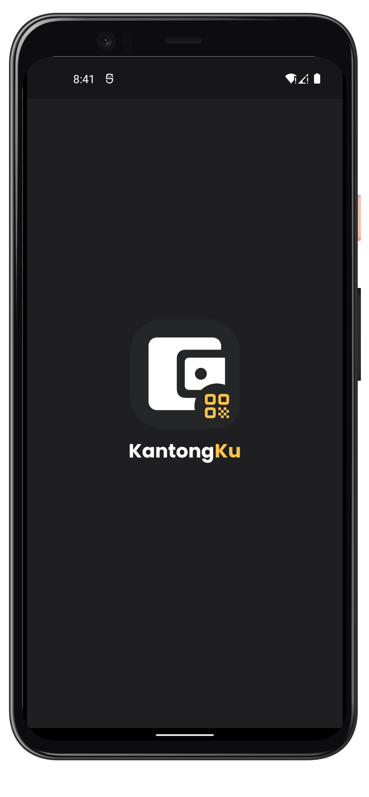
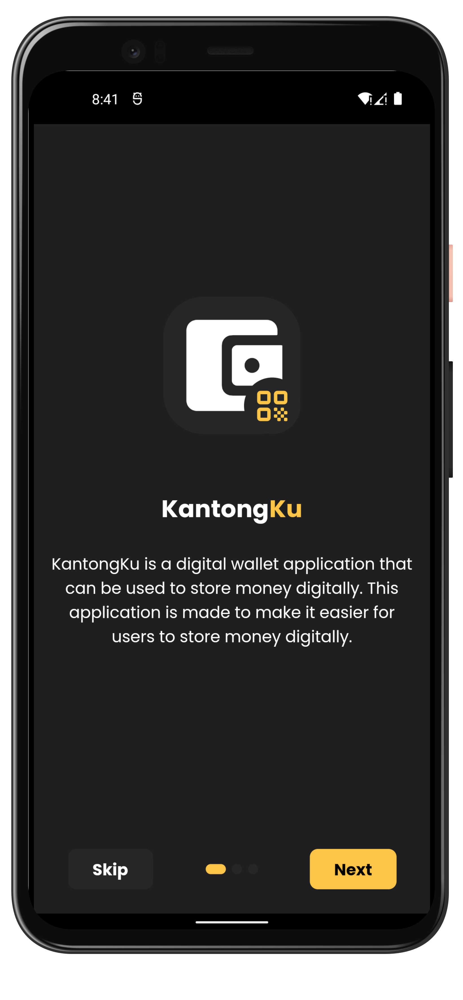
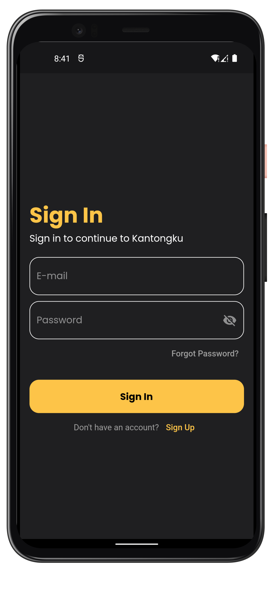
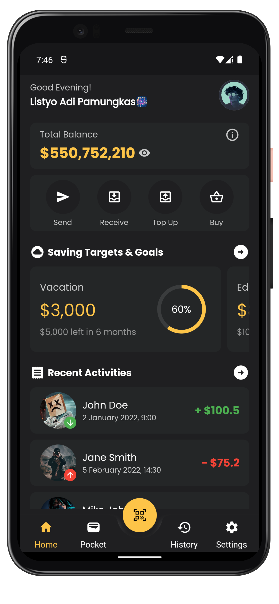
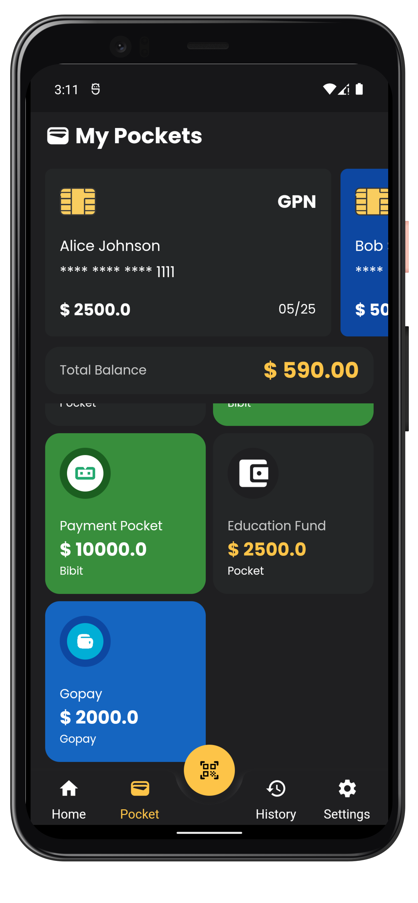

# KANTONGKU
Kantongku is an application that is used to record daily financial expenses and income. This application is a personal project of nerufuyo a.k.a Listyo Adi.
## Screenshot

## Future Features
* Add, edit, and delete transaction data
* Add, edit, and delete category data
* Add, edit, and delete account data
* Add, edit, and delete budget data
* Add, edit, and delete reminder data
* Add, edit, and delete debt data

## Tech Stack
* Dart
* Flutter
